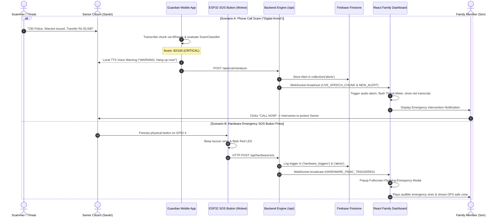

# Guardian Bot: End-to-End Integration & Connection Manual
### Real-Time Scam Detection & Family Alerting System for Senior Citizens

---

## 1. System Overview & Architecture

Guardian Bot provides multi-layered protection for senior citizens against deceptive scams (such as **"Digital Arrest"**, **Bank/KYC Phishing**, **AnyDesk Remote Screen Takeover**, and **Coercive Emergency Demands**). The platform combines:
1. **IoT Hardware Panic Station (ESP32 / Wokwi)** for instant one-touch SOS in the home.
2. **Mobile Device Shield (Android Kotlin & Cross-Platform)** for call/SMS interception, Whisper transcription, and immediate on-device voice warnings.
3. **Guardian Cloud Backend (Node.js/Express)** for rule-based multi-tier risk classification, Firestore sync, and WebSocket live broadcasting.
4. **Family Web Dashboard (React & Tailwind CSS)** for real-time threat monitoring, live audio waveform display, highlighted scam transcripts, and instant emergency intervention.



---

## 2. Firebase Firestore Setup

Guardian Bot includes a **Dual-Mode Engine**: it runs smoothly in **Reactive Demo Mode** with zero external dependencies, and seamlessly connects to **Live Firebase Firestore** when credentials are provided.

### Step 2.1: Create a Firebase Project
1. Navigate to the [Firebase Console](https://console.firebase.google.com/).
2. Click **Create a project** and name it `guardian-bot-senior-safety`.
3. Enable Google Analytics (optional) and click **Create Project**.

### Step 2.2: Set Up Firestore Database
1. In the left navigation, go to **Build** &rarr; **Firestore Database**.
2. Click **Create Database**, select a region close to your users (e.g., `asia-south1` or `us-central1`), and start in **Production Mode**.
3. Go to the **Rules** tab and paste the following security rules:

```javascript
rules_version = '2';
service cloud.firestore {
  match /databases/{database}/documents {
    
    // Protected Seniors Profile Collection
    match /seniors/{seniorId} {
      allow read: if true;
      allow write: if request.auth != null || request.resource.data.keys().hasAll(['name', 'status']);
    }

    // Threat Alerts Collection
    match /alerts/{alertId} {
      allow read: if true;
      allow create: if true;
      allow update: if request.auth != null || request.resource.data.status in ['ACKNOWLEDGED', 'RESOLVED'];
    }

    // Hardware Telemetry & Triggers
    match /hardware_triggers/{triggerId} {
      allow read: if true;
      allow create: if true;
    }
  }
}
```
Click **Publish**.

### Step 2.3: Retrieve Firebase Service Account Key (Backend)
1. In Firebase Console, click the **Gear Icon** (Project Settings) &rarr; **Service Accounts**.
2. Click **Generate new private key** and download the resulting JSON file.
3. Save this file inside the `/backend` folder as `serviceAccountKey.json`.

---

## 3. Backend Setup (`/backend`)

### Step 3.1: Install Dependencies & Configure Environment
```bash
cd backend
npm install
```

Copy the `.env.example` file to `.env`:
```bash
cp .env.example .env
```

### Step 3.2: Start the Backend Server
```bash
npm start
```
You will see the startup banner:
```
=======================================================
🛡️  GUARDIAN BOT BACKEND ENGINE IS RUNNING ON PORT 5000
📡  REST API:      http://localhost:5000/api
⚡  WebSocket:     ws://localhost:5000/ws
🔥  Database Mode: Reactive Memory Store (Demo Mode) / Firebase
=======================================================
```

### Step 3.3: Key REST API Endpoints

| Method | Endpoint | Description | Sample Body |
|---|---|---|---|
| `POST` | `/api/scam/analyze` | Scans text/speech transcript chunk | `{"text": "This is CBI officer, transfer money immediately"}` |
| `POST` | `/api/hardware/sos` | Ingests ESP32 SOS panic button press | `{"deviceId": "ESP32-SOS-01", "location": "Living Room"}` |
| `GET` | `/api/alerts` | Fetches active and historical alerts | `?status=ACTIVE&limit=20` |
| `PATCH` | `/api/alerts/:id` | Updates status (`ACKNOWLEDGED` / `RESOLVED`) | `{"status": "RESOLVED", "notes": "Grandma verified safe"}` |
| `GET` | `/api/seniors` | Lists protected senior profiles & battery | `N/A` |
| `POST` | `/api/simulate/run` | Triggers multi-chunk scam simulation | `{"scenarioKey": "DIGITAL_ARREST"}` |

---

## 4. Hardware Simulation Setup (`/hardware-sim`)

### Step 4.1: Schematic Pinout Map

| Hardware Component | ESP32 Pin | Description |
|---|---|---|
| **SOS Push Button** | `GPIO 4` | Active LOW with internal pull-up (`INPUT_PULLUP`). |
| **Status LED (Green)** | `GPIO 2` | Active HIGH with 220Ω resistor. Indicates WiFi is connected. |
| **Alert LED (Red)** | `GPIO 15` | Active HIGH with 220Ω resistor. Flashes rapidly during SOS. |
| **Piezo Buzzer Siren** | `GPIO 5` | Emits distinct dual-tone emergency siren. |
| **Ground (GND)** | `GND` | Common ground rail. |

### Step 4.2: Running in Wokwi Browser Simulator
1. Open [https://wokwi.com/projects/new/esp32](https://wokwi.com/projects/new/esp32)
2. In the `sketch.ino` tab, paste the code from `/hardware-sim/sketch.ino`.
3. In the `diagram.json` tab, paste the schematic from `/hardware-sim/diagram.json`.
4. Click **Start Simulation** (Green Play button).
5. Watch the Serial Monitor:
   - ESP32 connects to `Wokwi-GUEST` virtual WiFi.
   - Green LED turns **Solid ON**.
   - Click the red **SOS EMERGENCY** button in the simulation.
   - The buzzer plays the alarm melody, Red LED flashes, and the HTTP payload is transmitted to `/api/hardware/sos`.

---

## 5. Mobile Application Integration (`/mobile-app`)

### Step 5.1: Android Native Architecture
Open `/mobile-app/android` in **Android Studio**:
- `CallReceiver.kt`: Intercepts `PHONE_STATE` broadcasts and triggers `AudioTranscriptionService`.
- `SmsReceiver.kt`: Monitors incoming SMS for phishing links and OTP extraction keywords.
- `ScamClassifier.kt`: On-device fast regex and heuristic analyzer.
- `TtsAlertService.kt`: Alarm-channel voice synthesizer that speaks out warnings to senior citizens.
- `MainActivity.kt`: Senior-friendly accessible UI with large buttons and high contrast.

### Step 5.2: React Native / Expo Companion
To preview the Senior Mode mobile interface on any device:
```bash
cd mobile-app/react-native
npm install
npm start
```
Scan the QR code with the Expo Go mobile app (iOS or Android).

---

## 6. Family Web Dashboard (`/dashboard`)

### Step 6.1: Start the React Dashboard
```bash
cd dashboard
npm install
npm run dev
```
Open **http://localhost:5173** in your browser.

### Step 6.2: Core Dashboard Features
- **Threat Meter**: Animated radial gauge (0 to 100) reflecting real-time risk.
- **Live Call Stream**: Visual sound waveform and live speech transcription with glowing red/amber scam keyword tags.
- **Active Threat Log**: Real-time filterable log of intercepted incidents with 1-click resolution.
- **Emergency Panic Modal**: Flashing fullscreen red alarm modal with Senior GPS location, battery telemetry, and audio siren.
- **Interactive Scam Simulator**: Built-in testing panel with 1-click attack presets (CBI Digital Arrest, AnyDesk Takeover, OTP Phishing, Hardware SOS).
- **Senior Quick Call**: 1-tap direct dialing and WhatsApp emergency ping with pre-scripted de-escalation talking points.

---

## 7. End-to-End Test & Verification Scenarios

### Scenario 1: CBI Digital Arrest Call Test
1. On the React Dashboard, click **Scam Simulator** in the top navigation.
2. Click **CBI Officer Drug Parcel Scam**.
3. **Observe**:
   - Live Call Stream activates immediately with timer and animated audio waveform.
   - Speech chunks appear in real-time with suspicious phrases highlighted: *"narcotics FedEx consignment"*, *"Supreme Court arrest warrant"*, *"Digital Arrest"*, *"RBI verification account"*.
   - Threat Meter rises from 0 &rarr; 45 &rarr; **92/100 (CRITICAL THREAT)**.
   - Automated Voice Warning banner displays: *"WARNING: Law enforcement never demands money over video call."*
   - Critical Alert is added to the Threat Log.

### Scenario 2: Physical Hardware Panic Button Press
1. Click **ESP32 GPIO 4 Physical Panic Trigger** in the Scam Simulator (or press the button in Wokwi).
2. **Observe**:
   - Backend registers hardware trigger at `POST /api/hardware/sos`.
   - Fullscreen **Emergency Panic Modal** flashes on screen.
   - Web Audio emergency siren sounds in browser.
   - Senior location (*"Living Room Alarm Station"*) and battery status (*98%*) are displayed.
   - Click **Mark Senior Safe & Dismiss** to resolve the incident.

### Scenario 3: Bank OTP Phishing SMS Interception
1. In the Custom Speech / SMS Scanner box, paste:
   ```
   "Dear customer, your bank account is blocked. Please share your 6-digit OTP verification code to unfreeze."
   ```
2. Click **Scan Text**.
3. **Observe**:
   - Instant risk score calculation: **85/100 (CRITICAL)**.
   - Highlighted keywords: `bank account blocked`, `share otp`, `verification code`.
   - Threat event logged with immediate family intervention recommendation.
